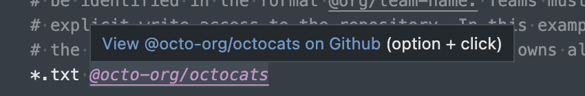
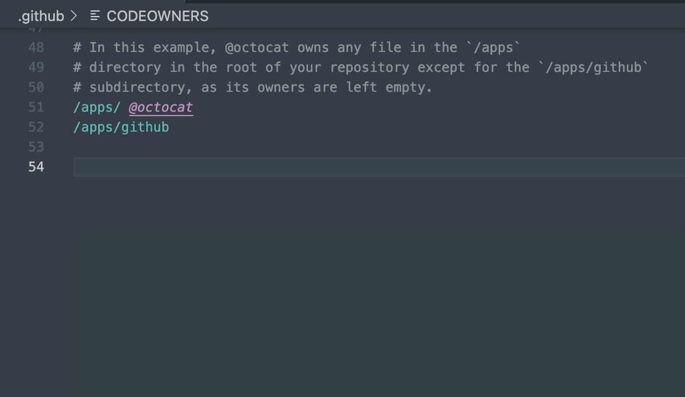
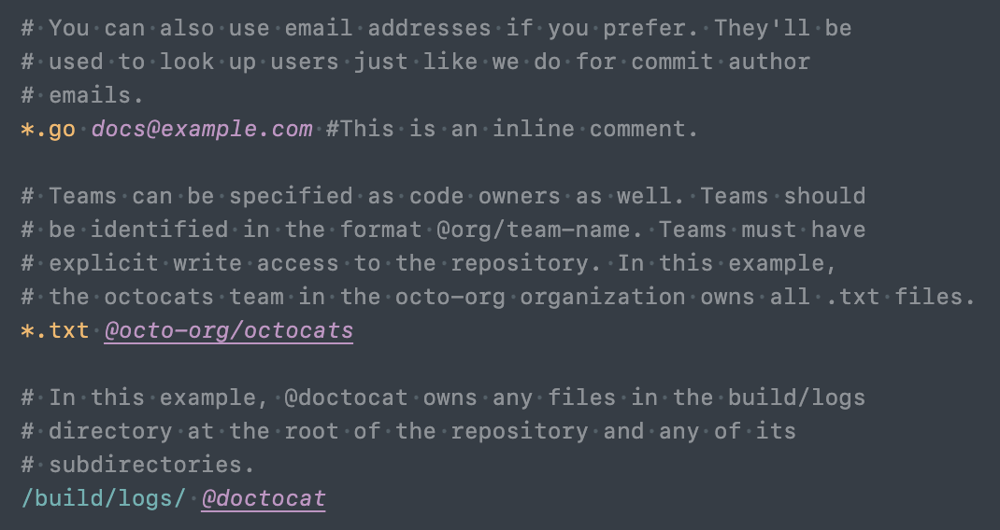

# [github-code-owners](https://github.com/chdsbd/vscode-github-code-owners)  

A VS Code extension to display the GitHub Code Owners for the current file, as defined in the [CODEOWNERS](https://help.github.com/articles/about-codeowners/) file.

## Features

### Status bar

Shows the first code owner. Click to see matching line in CODEOWNERS file.

  

### Language support

#### Link usernames to GitHub

#### Auto complete

#### Syntax highlighting

### Command

Open matching line in CODEOWNERS file with the `GitHub Code Owners: Show owners of current file` command.

## Install

### From online marketplace

Open the [online marketplace listing](https://marketplace.visualstudio.com/items?itemName=chdsbd.github-code-owners#overview) for GitHub Code Owners and click "Install". Follow the prompts to open VSCode and install GitHub Code Owners.

### From VSCode

In VSCode, type `CMD`+`P` and enter `ext install chdsbd.github-code-owners`. Or search for and install `chdsbd.github-code-owners` via the extensions tab.

### From Github release

Download the extension package from the [latest Github release](https://github.com/chdsbd/vscode-github-code-owners/releases/latest) and run `code --install-extension github-code-owners-*.vsix`

### From source

With `vsce` installed from NPM (`yarn global add vsce`), clone [this repo](https://github.com/chdsbd/vscode-github-code-owners) and run `vsce package`. Install the resulting package with `code --install-extension github-code-owners-*.vsix`

## Related extensions

- [CODEOWNERS](https://marketplace.visualstudio.com/items?itemName=jasonnutter.vscode-codeowners) by Jason Nutter
- [vs-codeowners](https://marketplace.visualstudio.com/items?itemName=dtangren.vs-codeowners) by softprops
- [CodeOwners](https://marketplace.visualstudio.com/items?itemName=HCoban.codeowners) by HCoban
- [CODEOWNERS Linter](https://marketplace.visualstudio.com/items?itemName=fmenezes.vscode-codeowners-linter) by Filipe Constantinov Menezes
- [Codeowners Extended](https://marketplace.visualstudio.com/items?itemName=noahm.codeowners-extended) by Noah Manneschmidt

## Fork

This repository is forked from [jasonnutter/vscode-codeowners](https://github.com/jasonnutter/vscode-codeowners), with UI changes and more correct CODEOWNERS compliance via [@snyk/github-codeowners](https://www.npmjs.com/package/@snyk/github-codeowners).
